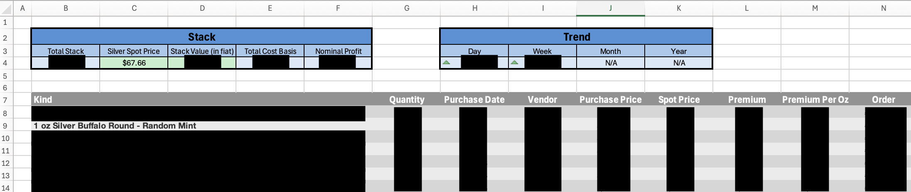

# Silver Portfolio Tracker
A dynamic Excel dashboard for tracking physical silver bullion holdings, including relevant purchase information, cost basis, premiums, portfolio value, and performance trends. Uses VBA and AppleScript to automatically collect and update live spot-price data from an API.

## Features

- Retrieves live silver spot-price data from an external API
- Automatically refreshes market data using VBA and AppleScript
- Tracks individual purchases, cost basis, premiums, and current portfolio value
- Records daily portfolio values to maintain a historical performance record
- Calculates 1-day, 7-day, 30-day, and 365-day changes in portfolio value
- Provides visual indicators for changes in silver price and portfolio performance

## How It Works

The workbook uses VBA and AppleScript to retrieve live silver spot-price data from an external API and update the Excel dashboard automatically. Excel formulas combine the live market price with purchase and holdings data to calculate current value, cost basis, profit, premiums, and historical performance.

## Technologies

- Microsoft Excel
- VBA
- AppleScript
- REST API / JSON
